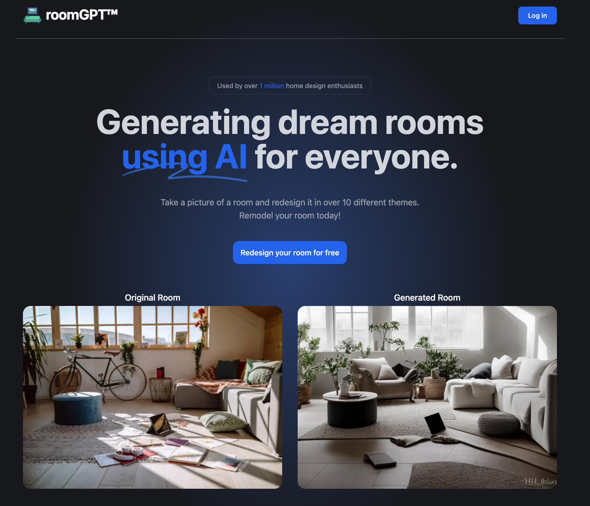

# [roomGPT.io](https://roomGPT.io)

This project generates new designs of your room with AI.

[](https://roomGPT.io)

## How it works

It uses an ML model called [ControlNet](https://github.com/lllyasviel/ControlNet) to generate variations of rooms. This application gives you the ability to upload a photo of any room, which will send it through this ML Model using a Next.js API route, and return your generated room. The ML Model is hosted on [Replicate](https://replicate.com) and [Upload](https://upload.io) is used for image storage.

## Running Locally

### Cloning the repository the local machine.

```bash
git clone https://github.com/Nutlope/roomGPT
```

### Creating a account on Replicate to get an API key.

1. Go to [Replicate](https://replicate.com/) to make an account.
2. Click on your profile picture in the top right corner, and click on "Dashboard".
3. Click on "Account" in the navbar. And, here you can find your API token, copy it.

### Storing the API keys in .env

Create a file in root directory of project with env. And store your API key in it, as shown in the .example.env file.

If you'd also like to do rate limiting, create an account on UpStash, create a Redis database, and populate the two environment variables in `.env` as well. If you don't want to do rate limiting, you don't need to make any changes.

### Installing the dependencies.

```bash
npm install
```

### Running the application.

Then, run the application in the command line and it will be available at `http://localhost:3000`.

```bash
npm run dev
```

## Auth setup

1. Use `openssl rand -base64 32` to generate NEXTAUTH_SECRET
2. Add DB URL and SHADOW DB URL from Neon
3. Create a new project in console.cloud.google.com
4. Click configure consent screen in API credentials page and click external
5. Add an app name, do not upload logo, add authorized domain
6. Publish app
7. Create credentials -> Oauth client ID
8. Run npx prisma db push && prisma migrate dev && prisma generate

## One-Click Deploy

Deploy the example using [Vercel](https://vercel.com?utm_source=github&utm_medium=readme&utm_campaign=vercel-examples):

[](https://vercel.com/new/clone?repository-url=https://github.com/Nutlope/roomGPT&env=REPLICATE_API_KEY,NEXTAUTH_SECRET,GOOGLE_CLIENT_ID,GOOGLE_CLIENT_SECRET,DATABASE_URL,SHADOW_DATABASE_URL,NEXTAUTH_URL&project-name=room-GPT&repo-name=roomGPT)

> Note: You will need to configure auth by following the setup above by using Neon and next-auth

When I create the PR:

- Add Vercel preview URL to Google for auth as a redirect URL
- Add the webhook URL to Stripe
- Add DIRECT_DATABASE_URL to the specific preview environment for Neon to work
- Change environment variables on Vercel to Stripe production ones
- Make sure I add all secrets on Vercel for production as well
- Verify the pricing ID table
- On Stripe, make sure products are in production like pricing table
- Test with a real credit card to make sure it's working
